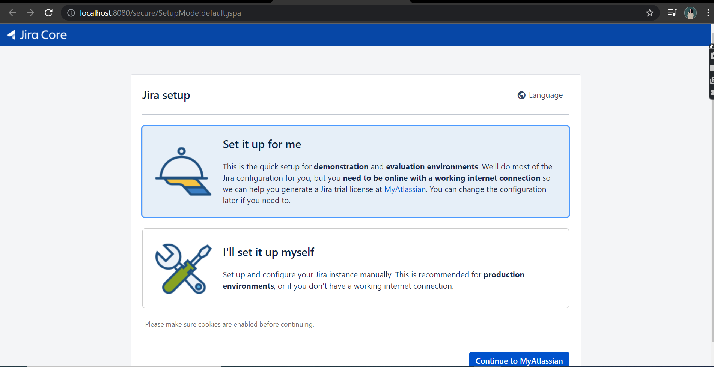

# ✅ AGILE+JIRA

It is the responsibility of both the Developer and QA to deliver a fruitful product irrespective of their roles.

#### Step 1- You have a project to develop. Eg: Credit card online banking application.

#### Step 2-Features to develop

* Login Page
* Dashboard
* Profile

#### Step 3-Install JIRA in Local machine


[https://www.atlassian.com/software/jira/download/data-center](https://www.atlassian.com/software/jira/download/data-center)


complete the installation. JIRA will be running as a service in your local machine at port 8080.

#### Steps:

* Click on 'set it up for me'
* Sign up with google or any
* After successful sign up, 'SERVER ID' can be found.

.png>)

* Enter the organization name of your choice.
* Click on generate License


After creating License , complete within 2 within or else license will get expired


* Enter the details&#x20;
*

.png>)

.png>)

.png>)

* Create  new project to learn about scrum software development

.png>)

* Set name for the project and key

.png>)

#### After successful set up of JIRA in local machine

.png>)


After shut down , if you want to relaunch

C->Users->UserName->Atlassian->jira->bin->start-jira->Now enter localhost:8080 in browser

